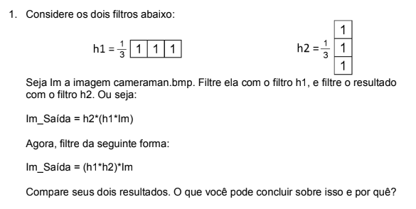
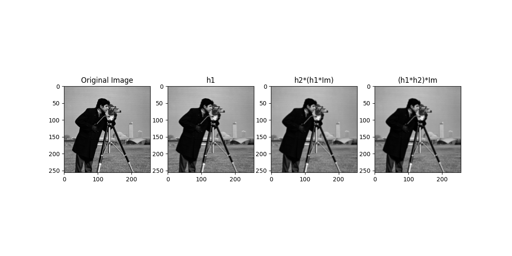
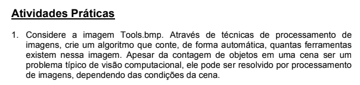
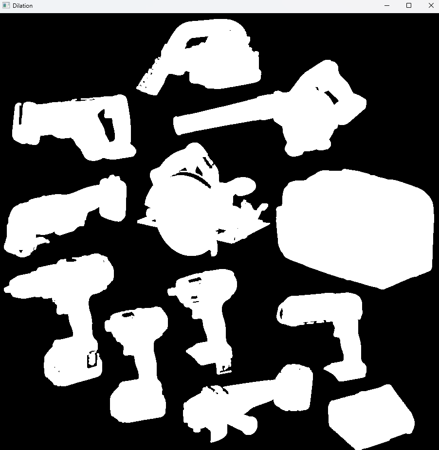
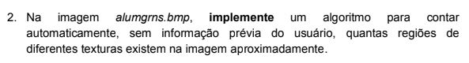
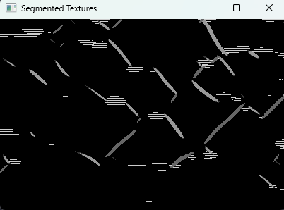

# Digital-image-processing
Digital Image Processing exercices

`python .\cameraman.py` to run the exercise 1 code.

`python .\tools.py` to run the exercise 2 code (look at the terminal and see output)

`python .\alumgrns.py` to run the exercise 3 code (look at the terminal and see output)

